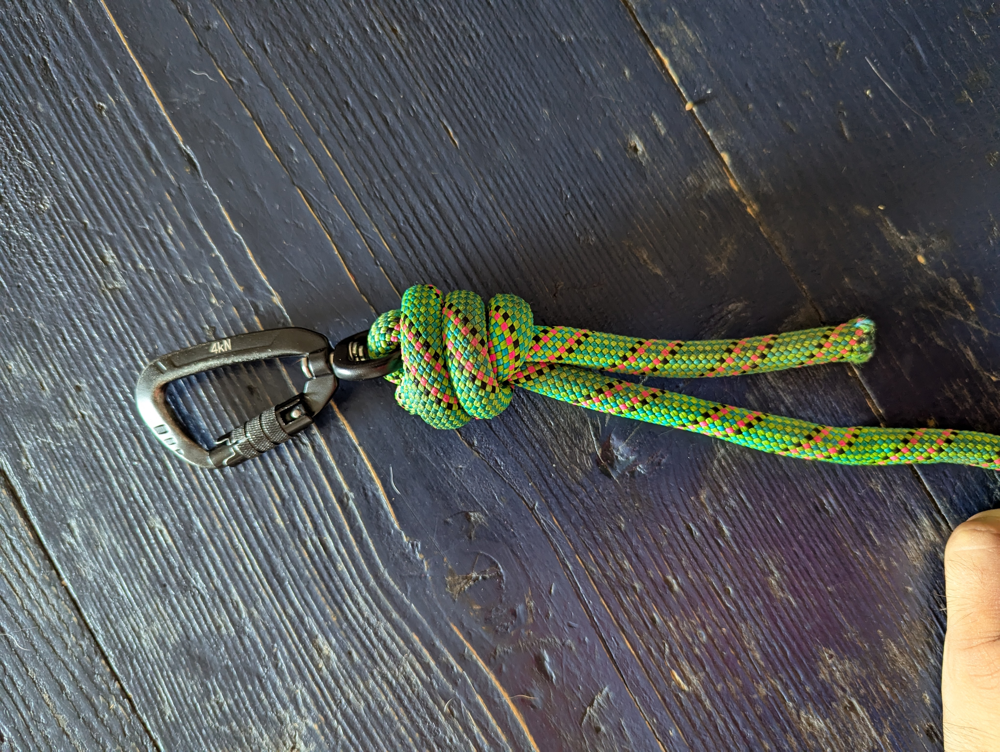

# Istruzioni su come creare il guinzaglio/corda per Alfie

## Necessario
- corda spessa circa 10 mm e lunga 4 metri
- corda corta e non molto spessa che verra' usato per accorciare/allungare la
corda principale
- moschettone girevole 360 gradi

## Creare i nodi

1- Creare il primo nodo alla base, utilizziamo un **Scaffold knot** che deve
passare all'interno del moschettone, ricordiamo di lasciare qualche centimetro
di corda in eccesso per sicurezza.
Questo nodo si stringera' al massimo una volta tirato e quindi si "saldera'" in
posizione.

Scegliamo di usare questo nodo invece di un Bowline knot con sicura (stopper), come fatto
precedentemente, perche' con questo metodo abbiamo un ingombro inferiore dei
nodi dato che non c'e' bisogno della sicura, il che rende la corda meno pesante
in quel punto e quindi meno peso per il cane.

2- Per il manico utilizziamo il **Scotts locked bowline**, una variante del
Bowline classico che e' piu' sicuro e blocca la corda in modo che non scorra.
Ricordasi di lasciare sempre un po' di corda in eccesso per sicurezza.

Precedentemente utilizzavamo il bowline classico con lo Strangle knot come
stopper ma con il tempo e il tiraggio del cane, il manico si ristringeva. Questa
nuova variante dovre evitare questo.

3- Con la corda piu' piccola, creiamo il nodo scorsoio (_slide and grip_) semplice
che si chiama **Prusik knot** (una specie di doppio Cow hitch). Questo nodo ci
permettera' di accorciare o allungare la nostra corda su se stessa.

4- Leghiamo il resto della corda piccola al Bowline che abbiamo creato al punto 3,
il manico della nostra corda. Bisognera legare la corda piccola con se stessa,
usando il nodo **Double (or Triple) fisherman's bend**, facendo passare il loop del manico
all'interno.

