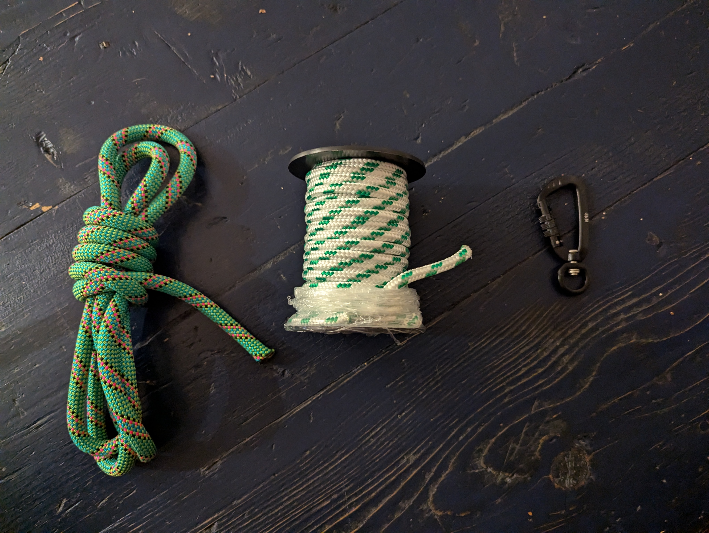
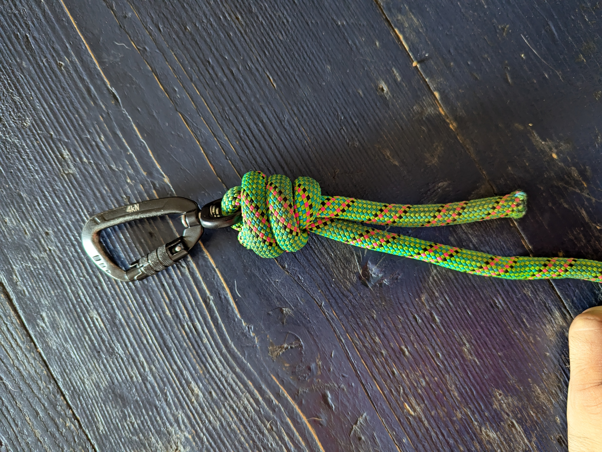
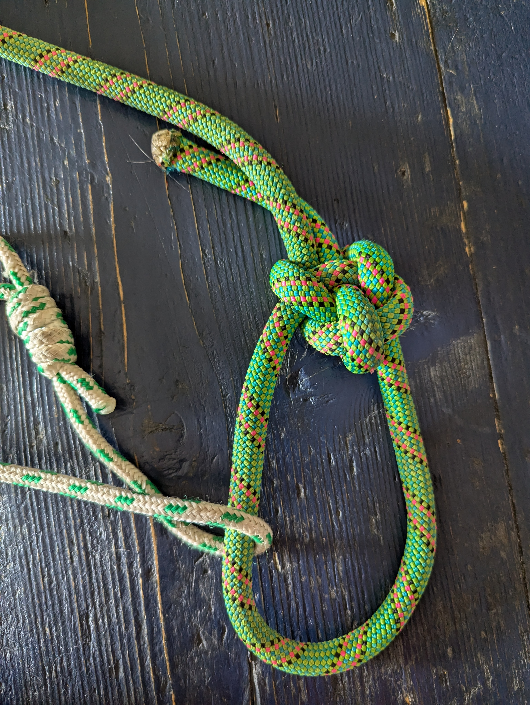
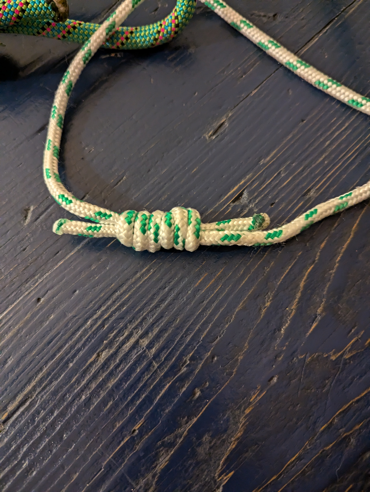

# Dog leash
How to create a dog leash that can be shortened at will.

## What do you need
- 4 meter rope of 10 mm diameter. Try to have a light rope, if it is the case go for
  a smaller diameter
  best
- another rope, which can be of a different diameter. This rope will be used to
  shorte the leash
- 360 degree swivel carabiner

## Build
1- Create the first knot at the base, we use a **Scaffold knot** that must
pass inside the carabiner, remember to leave a few centimeters
of excess rope for safety.
This knot will tighten to its maximum when pulled and then “weld” into
position.

We choose to use this knot instead of a Bowline knot with a safety (stopper), as done
previously, because with this method we have a smaller footprint of the
knots since there is no need for the safety, which makes the rope less heavy
at that point and therefore less weight for the dog.

2- For the handle we use the **Scotts locked bowline**, a variation of the
classic bowline that is safer and locks the rope so it doesn't run.
Remember to always leave some excess rope for safety.

Previously we used the classic bowline with the Strangle knot as a
stopper but with time and the pulling of the dog, the handle would shrink. This
new variation should avoid this.

3- With the smaller rope, we create the simple slip knot (_slide and grip_)
which is called a **Prusik knot** (a kind of double Cow hitch). This knot will
will allow us to shorten or lengthen our rope on itself.

4- We tie the rest of the small rope to the Bowline we created in step 2,
the handle of our rope. We will need to tie the small rope with itself,
using the **Double (or Triple) fisherman's bend** knot, passing the handle loop
inside.

For the fisherman's bend, more rounds are done and better it is, so we will go
for a triple fisherman's bend.

