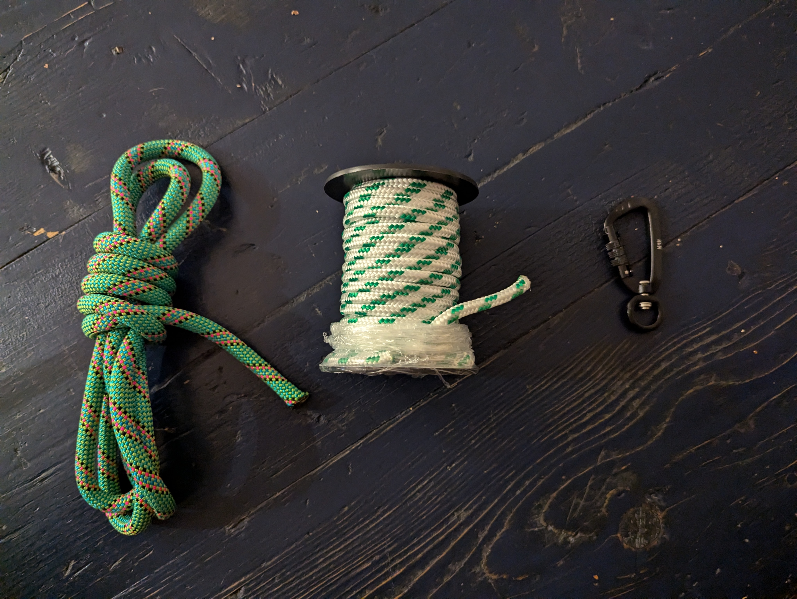
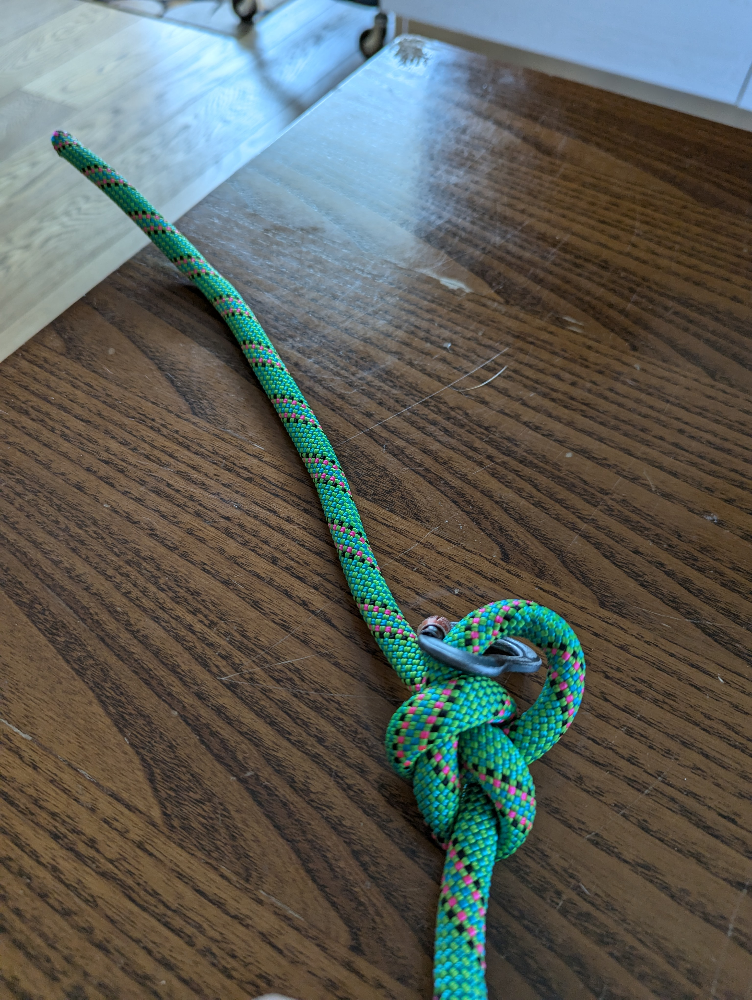
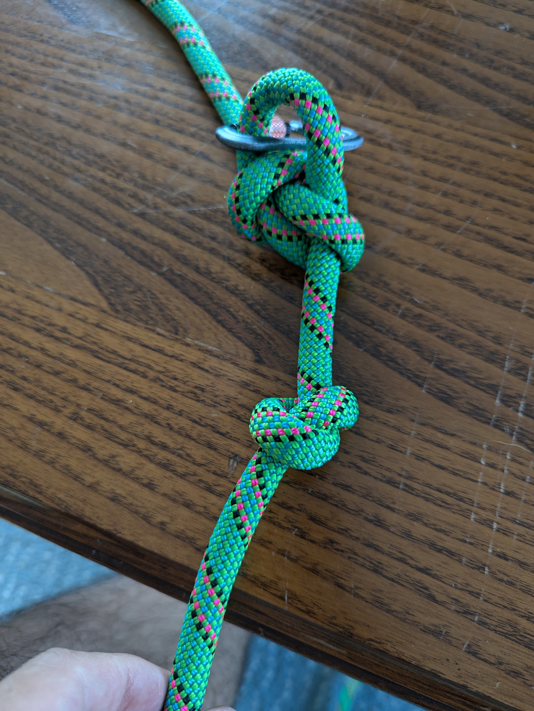
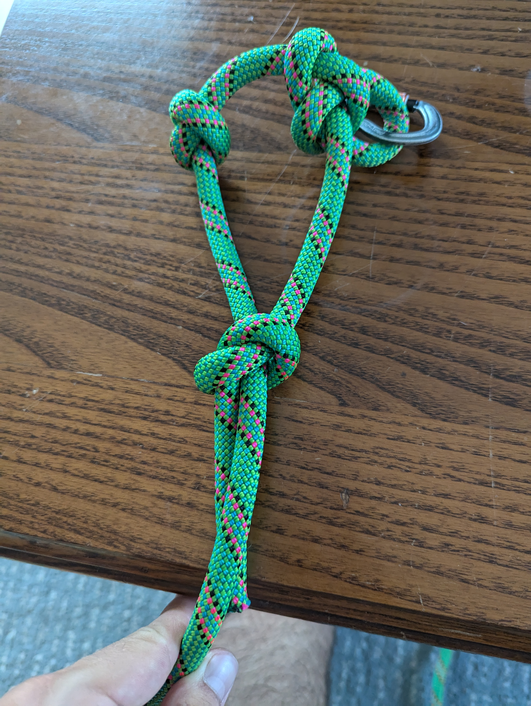
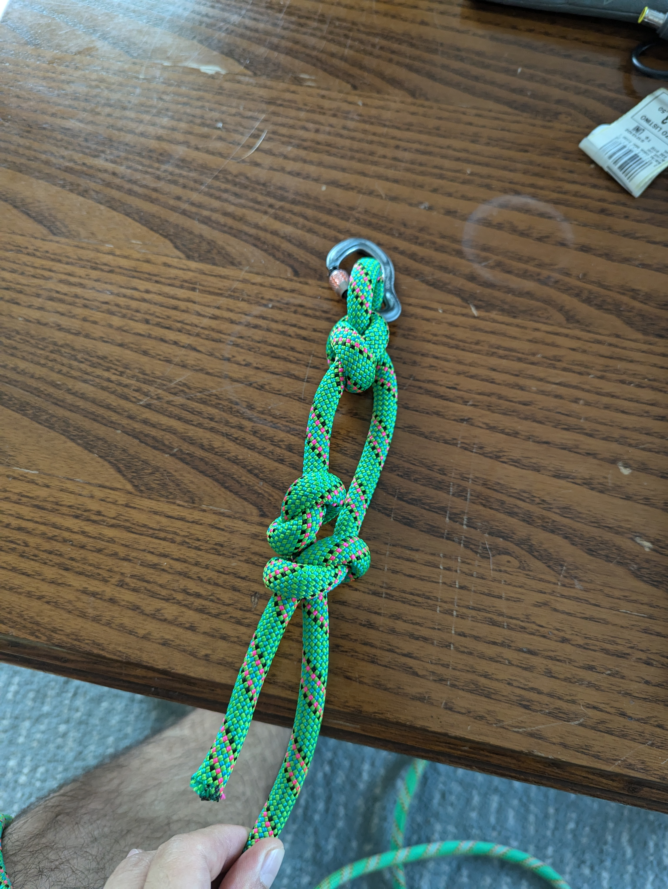
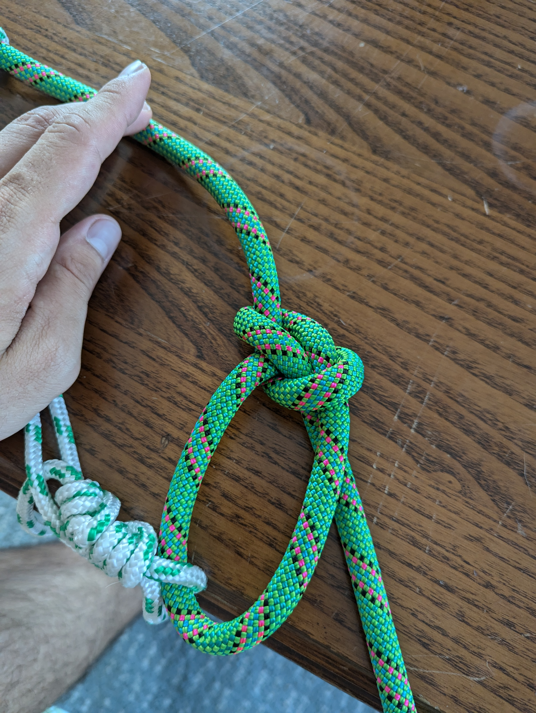
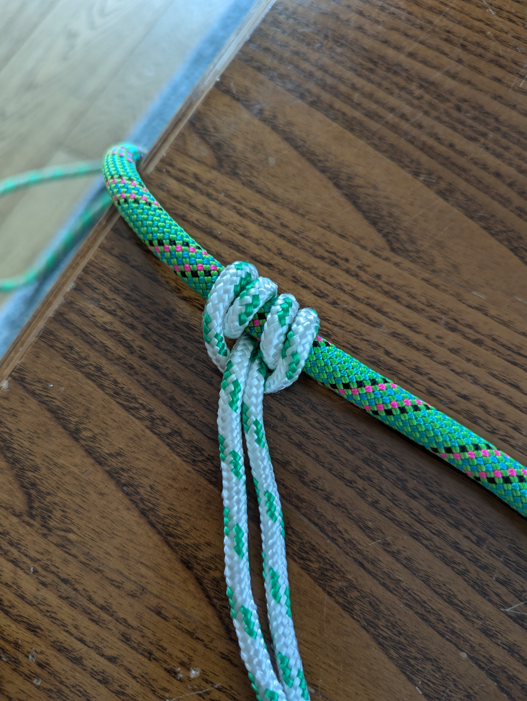
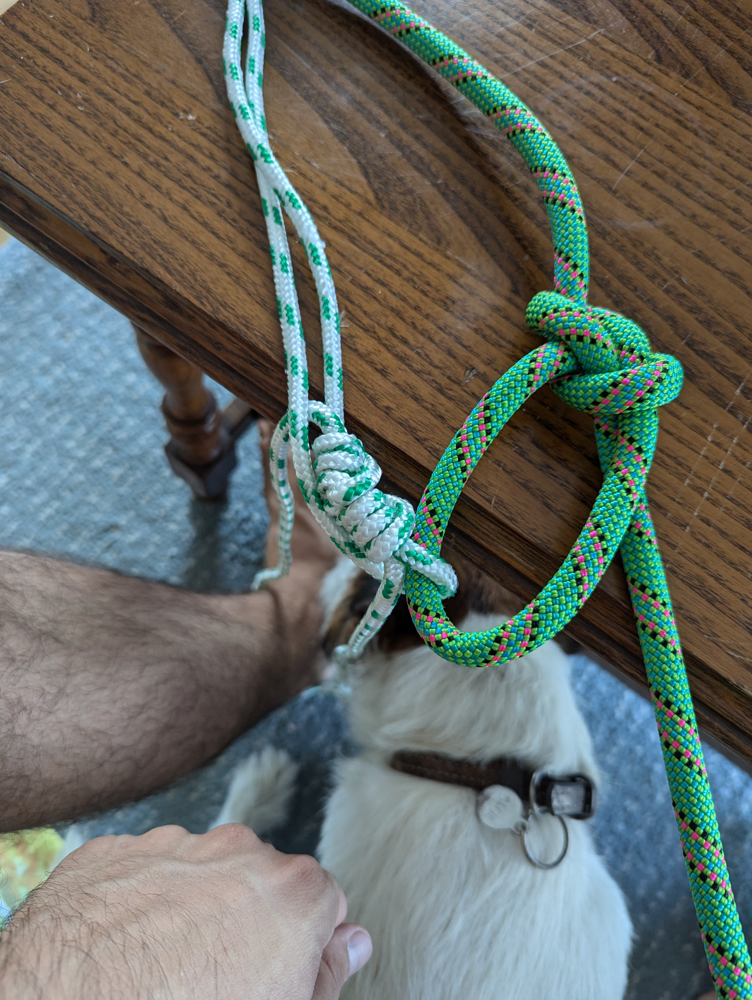

# Istruzioni su come creare il guinzaglio/corda per Alfie
## Necessario
1- corda spessa circa 10 mm e lunga 4 metri
2- corda corta e non molto spessa che verra' usato per accorciare/allungare la
corda principale
3- moschettone girevole 360 gradi

## Creare i nodi

1- Creare il primo nodo alla base, utilizziamo un **Bowline knot** facendo in modo che
la grandezza del buco sia piccola, dato che dovremmmo metterci il morsetto, e
che abbia tanta corda in eccesso. Questa corda serve per rendere il nodo piu'
sicuro, infatti faremo in modo di creare dei stopping knots in modo per evitare
che si snodi il bowline.

2- Creare un nodo semplice (**Overhand knot**) a un paio di centimetri dal Bowline
appena creato. Questo nodo servira come _stopper_ per il prossimo nodo

3- Con la corda in eccesso del primo nodo, bisognera' creare un altro nodo
semplice (**Overhand knot**) al di sopra del nodo creato al punto 2. Questo nodo
semplice dovra' far passare dentro di se' la corda principale. Alla fine il nodo
dovra essere in grado di scorrere per la corda e se tirato andra' a "sbattere"
contro il nodo _stopper_ creato al punto 2. Questo impedira' alla corda in eccesso
di essere tirata troppo e quindi il nodo al punto 1 (Bowline) non si potra'
disfare.

4- Ora dobbiamo creare un altro **Bowline knot** dall'altra parte della corda.
Questo loop ci servira' per legarci il nodo scorsoio (slide and grip)

5- Con la corda piu' piccola, creiamo il nodo scorsoio (_slide and grip_) semplice
che si chiama **Prusik knot** (una specia di doppio Cow hitch). Questo nodo ci
permettera' di accorciare o allungare la nostra corda su se stessa.

6- Leghiamo il resto della corda piccola al Bowline che abbiamo creato al punto 4,
il manico della nostra corda. Bisognera legare la corda piccola con se stessa,
usando il nodo **Double (or Triple) fisherman's band**, facendo passare il loop del manico
all'interno.

