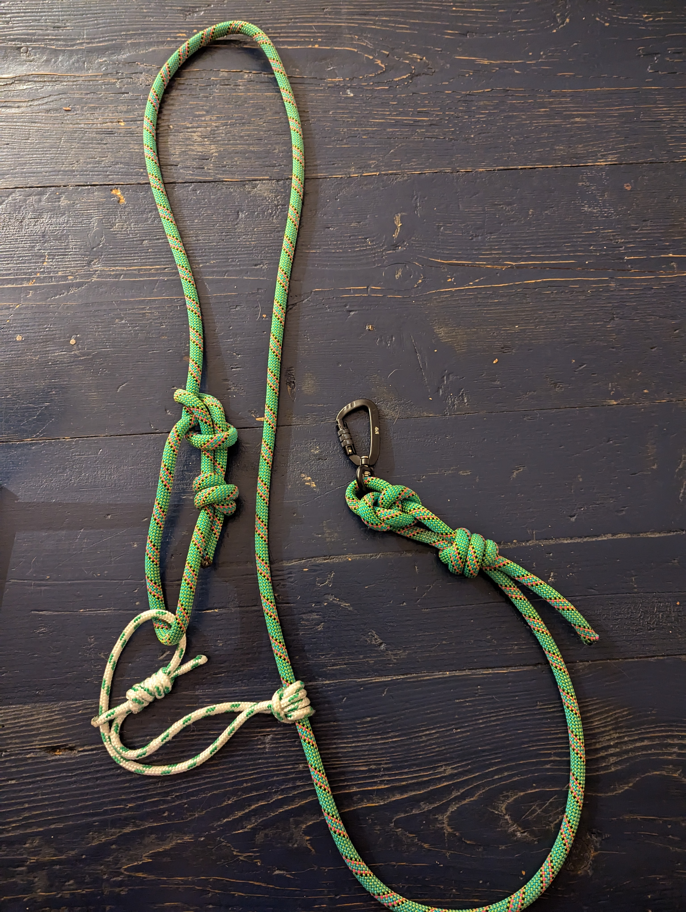
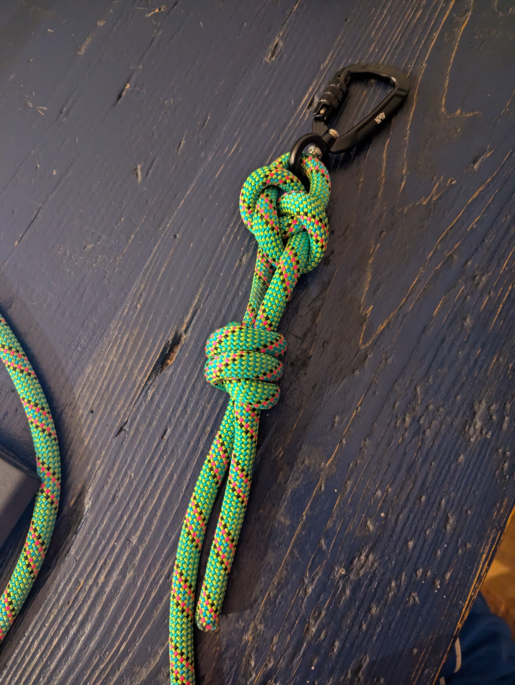
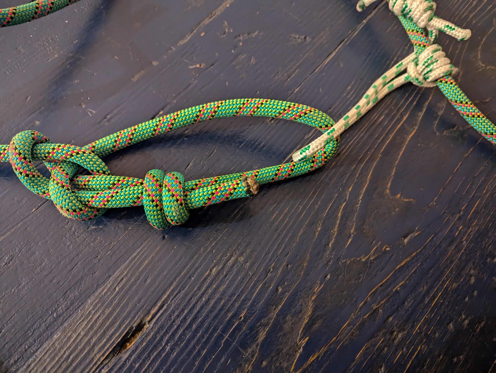
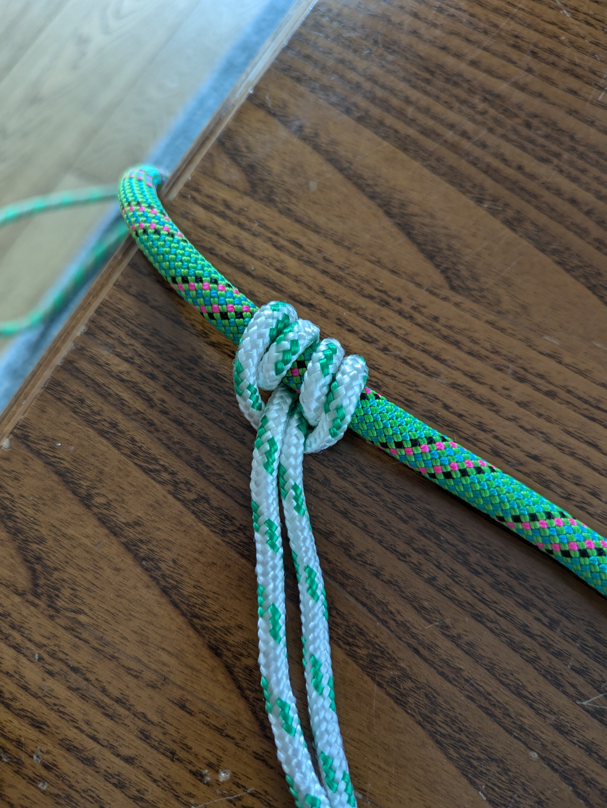
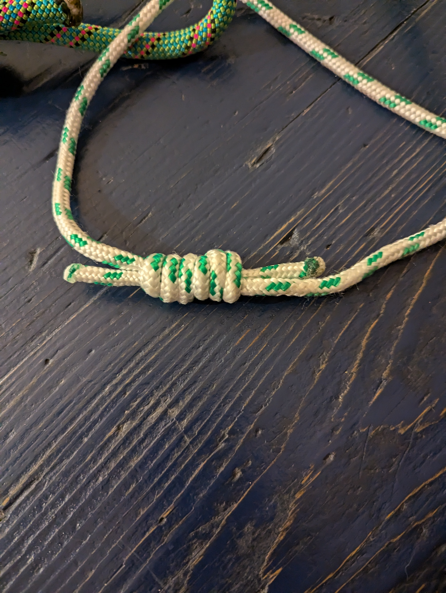

# Istruzioni su come creare il guinzaglio/corda per Alfie

## Necessario
- corda spessa circa 10 mm e lunga 4 metri
- corda corta e non molto spessa che verra' usato per accorciare/allungare la
corda principale
- moschettone girevole 360 gradi

## Creare i nodi

1- Creare il primo nodo alla base, utilizziamo un **Bowline knot** facendo in modo che
la grandezza del buco sia piccola, dato che dovremmmo metterci il morsetto, e
che abbia tanta corda in eccesso. Questa corda serve per rendere il nodo piu'
sicuro, infatti creeremo uno stopping/safety knots in modo da evitare
che si snodi il bowline.

2- Con la corda in eccesso del primo nodo, bisognera' creare un altro come
stopper/safety knot, utilizziamo lo **Strangle knot**,  al di sopra del primo
nodo.
Questo impedira' alla corda in eccesso di essere tirata troppo e quindi il nodo
al punto 1 (Bowline) non si potra' disfare.

(In questo caso ho utilizzato uno doppio strangle knot solo per estetica)

3- Ora dobbiamo creare un altro **Bowline knot** dall'altra parte della corda.
Questo loop ci servira' per legarci il nodo scorsoio (slide and grip)

Dobbiamo tenere un po' di corda in eccesso dal Bowline e creare un altro
stopper/dafety knot, **Strangle knot**, questa volta pero' lo facciamo dentro al
bowline dato che abbiamo spazio e ci permette di ingombrare meno.

4- Con la corda piu' piccola, creiamo il nodo scorsoio (_slide and grip_) semplice
che si chiama **Prusik knot** (una specie di doppio Cow hitch). Questo nodo ci
permettera' di accorciare o allungare la nostra corda su se stessa.

5- Leghiamo il resto della corda piccola al Bowline che abbiamo creato al punto 3,
il manico della nostra corda. Bisognera legare la corda piccola con se stessa,
usando il nodo **Double (or Triple) fisherman's band**, facendo passare il loop del manico
all'interno.

