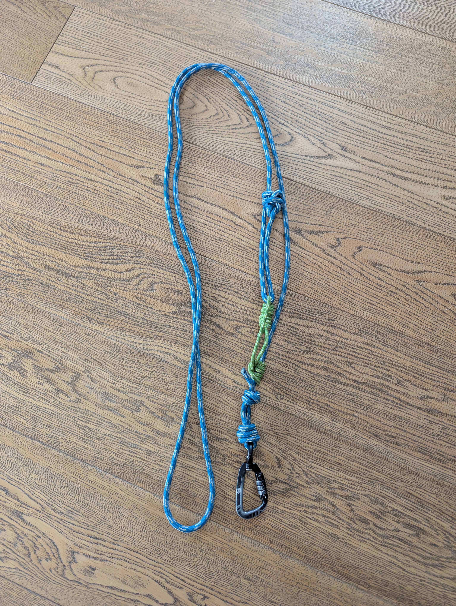
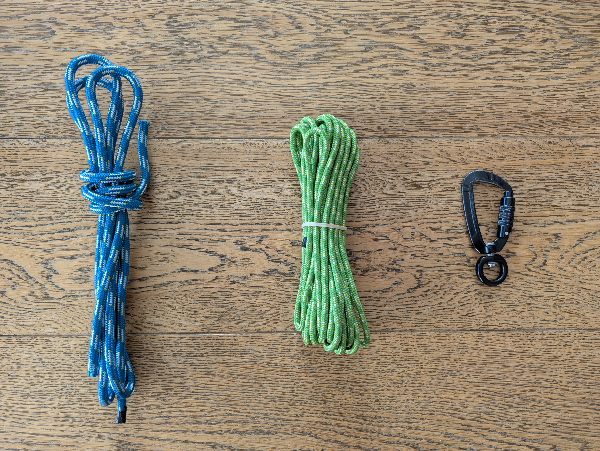
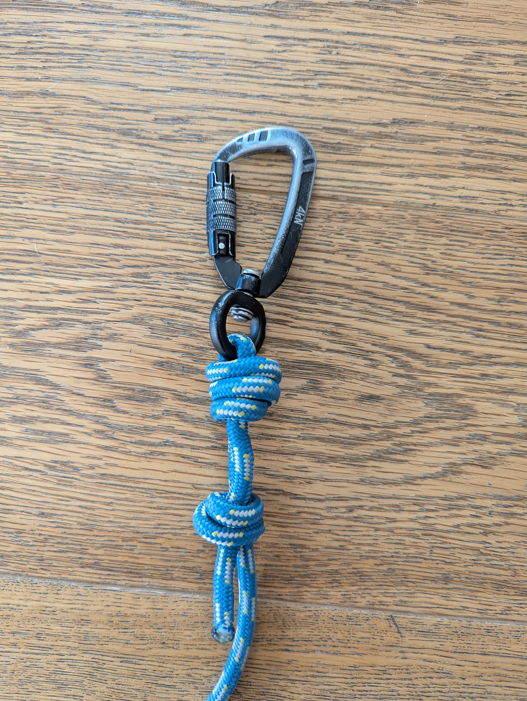
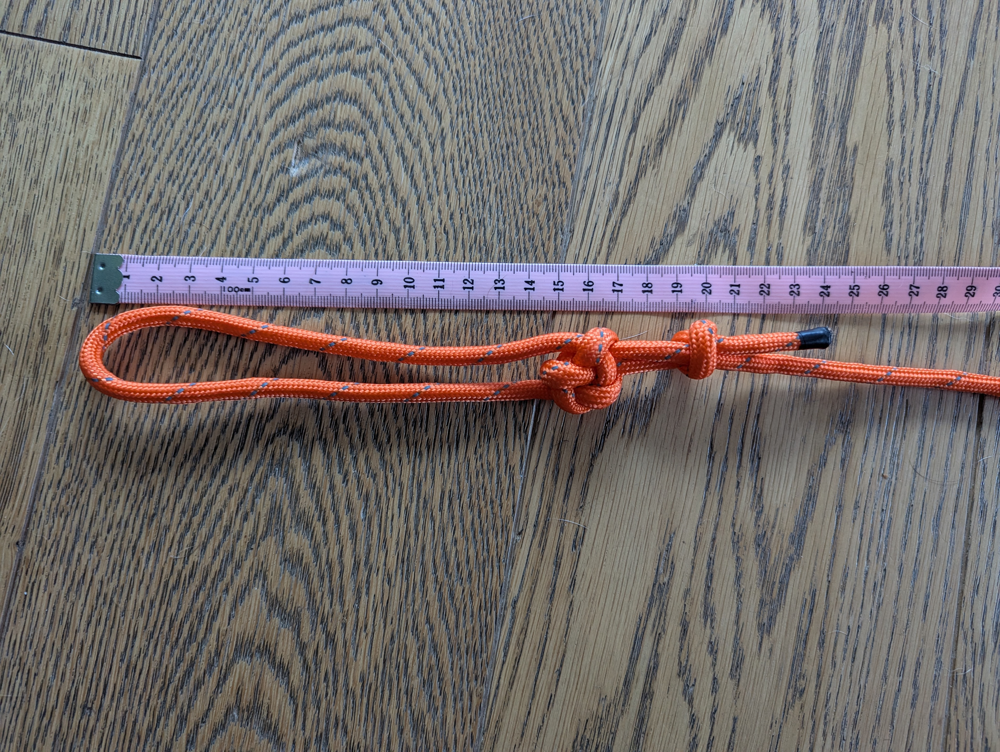
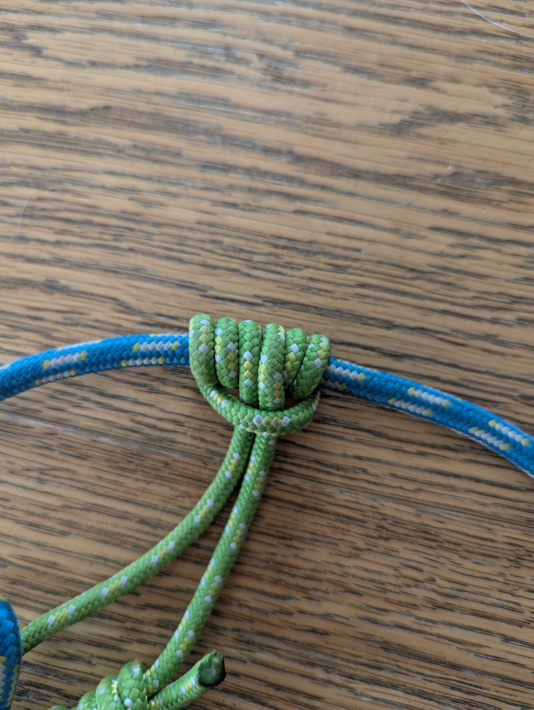
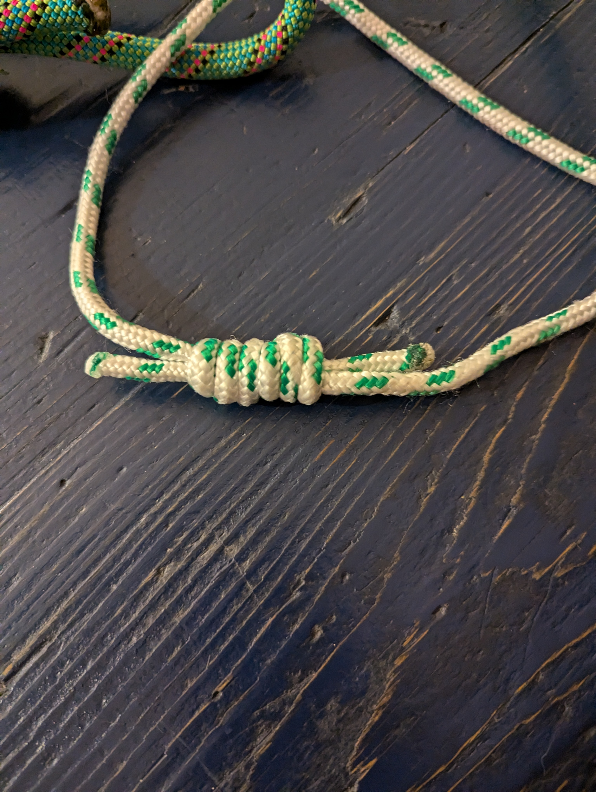
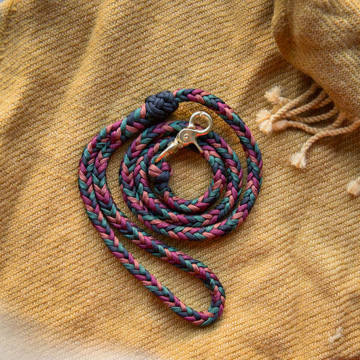
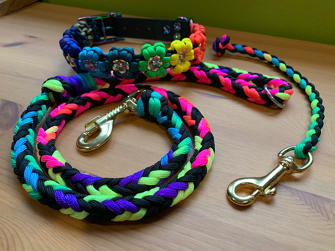

# Dog leash
How to create a dog leash that can be shortened at will.

## What do you need

- 4 meter rope of 6 mm diameter
- 60 cm rope of 4 mm diameter, this rope will be used to shoreter the leash.
- 360 degree swivel carabiner

## Build
1- Create the first knot at the base, we use a **Scaffold knot** that must
pass inside the carabiner, remember to leave a few centimeters
of excess rope for safety.
This knot will tighten to its maximum when pulled and then “weld” into
position.\
**Note**: With the excess rope you can create a Double overhand stopper knot, this
will "stick" the excess rope to the main rope making it more beautiful to see;
also the Double overhand knot is beautiful.

We choose to use this knot instead of a Bowline knot with a safety (stopper)
because with this method we have a smaller footprint of the knots since there is
no need for the safety, which makes the rope less heavy at that point and
therefore less weight for the dog.

2- For the handle we use the **Scotts locked bowline**, a variation of the
classic bowline that is safer and locks the rope, so it doesn't run.
Remember to always leave some excess rope for safety.

Previously we used the classic bowline with the Strangle knot as a
stopper but with time and the pulling of the dog, the handle would shrink. This
new variation should avoid this.

3- With the smaller rope, we create the simple slip knot (_slide and grip_)
which is called a **Prusik knot** (a kind of triple Cow hitch). This knot will
allow us to shorten or lengthen our rope on itself. It is suggested to do at
least three turns around the main rope, do more turns if more grip is needed.

4- We tie the rest of the small rope to the Bowline we created in step 2,
the handle of our rope. We will need to tie the small rope with itself,
using the **Double (or Triple) fisherman's bend** knot, passing the handle loop
inside.

For the fisherman's bend, more rounds are done and better it is, so we will go
for a triple fisherman's bend.

# Herringbone dog leash
`Herringbone leash` are leashes created through the interweaving of ropes and
are more decorative than the one described above.

