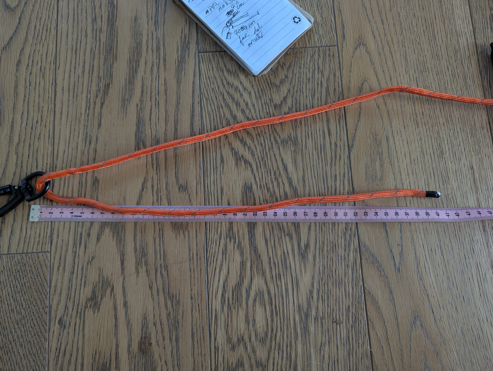
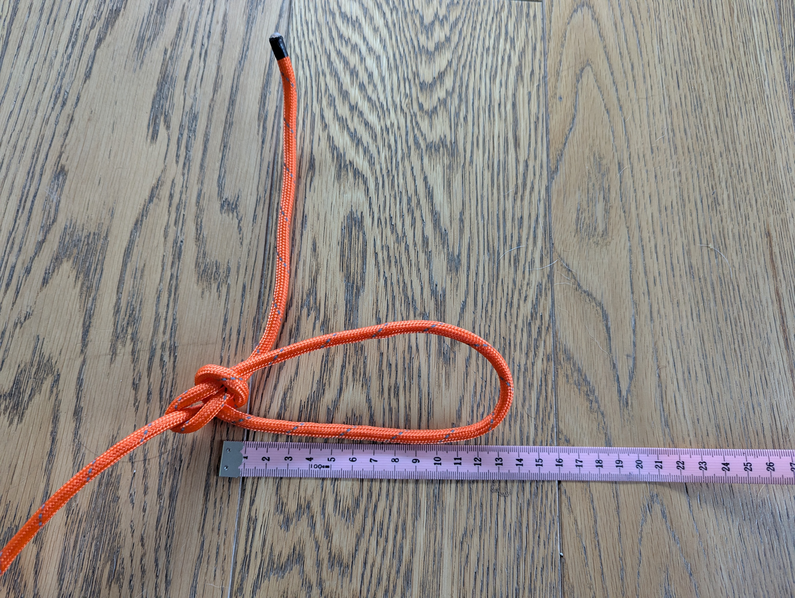
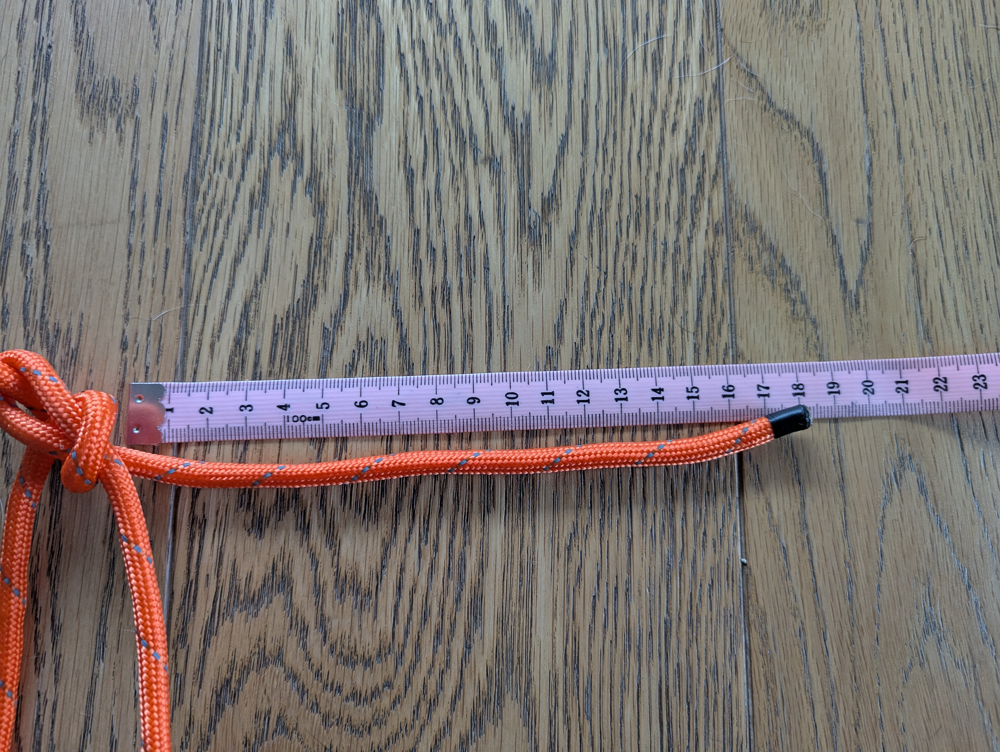
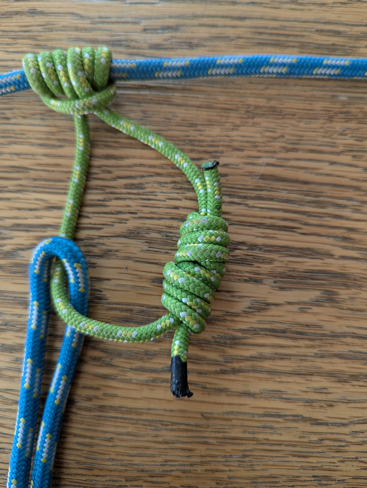

# Dog leash
How to create a dog leash that can be shortened at will.

## What You Need

- 360 degree swivel carabiner
- 6 mm diameter rope — this will be the main leash
- 4 mm diameter rope — used to shorten the leash

> **Note**: I recommend using ropes of two different colors.\
> This makes them easier to identify when reacing to shorten the leash.

### Lengths

- **6 mm rope**: You can make it long as you like, but keep in mind that knots
  will reduce the total length by approximately **80 cm**.
  For example, if you start with a 5 m rope, the final length will be around
  **4.20 m** after tying the necessary knots.

- **4 mm rope**: For a compact setup, **60 cm** rope is enough.\
  For more flexibility, I recomend using **90 cm**.

## Build
### 1. Attach the Carabiner with a Scaffold Knot

Create the first knot at the base of the leash using a **Scaffold knot**.\
This knot will pass through the carabiner. Be sure to leave a few centimeters of
excess rope for safety.

The Scaffold knot tightens under tension and will effectively “weld” into position.

> **Note:** With the excess rope, you can tie a **Double Overhand Stopper Knot**.\
> This keeps the excess rope close to the main rope and improves the visual appearance.\
> (Also, the Double Overhand Knot just looks good.)

We chose this knot instead of a Bowline + stopper combo because the Scaffold
knot has a smaller footprint, which reduces the weight at that point — important
for the dog’s comfort.

#### Rope Length

We recomend using at least **40 cm** of rope after the carabiner.\
This provides enough length to tie the Scaffold knot comfortably and add a
stopper knot if desired.

#### Final Result

---

### 2. Create the Handle with a Scotts Locked Bowline

For the handle, use the **Scotts Locked Bowline** — a variation of the classic
Bowline that’s safer and prevents the rope from slipping.

As always, leave some extra rope at the end for safety.

> **Note**: We previously used a classic Bowline with a Strangle Knot as a
> stopper.\
> However, over time, the handle would shrink due to the dog pulling.\
> The Scotts Locked Bowline solves this by staying secure under tension.

#### Rope Length

We recomend these following lengths:
- **Before tightening the simple Bowline**:
    - **13 cm** loop length
      
    - **18 cm** of excess rope
      

- **After completing the Scotts variation and tightening the knot**:
    - **15 cm** final loop length
    - **12 cm** of excess rope (withouth the stopper knot)\
      This is a bit too much, we suggest aiming for **10 cm** instead.

#### Final Result

---

### 3. Add the Prusic Knot for Adjustability

Using the **4 mm rope**, create a **Prusik Knot** around the main leash.\
This is a type of slide-and-grip knot (similar to a triple Cow Hitch) that
allows you to shorten or lengthen the leash.

Wrap the rope around the main leash **at least three times** — more turns will
provide more grip.

#### Rope Length

As mentioned at the beginning of this guide:

- For a **compact setup**, a **60 cm** rope is enough.
- For more flexibility and easier handling, we recommend using **90 cm**.

#### Final Result

---

### 4. Attach the Small Rope to the Handle Loop

Tie the remaining ends of the small rope to the Bowline loop you created in step
2.\
Use a **Double or Triple Fisherman's Bend**, passing the loop of the handle
inside before finishing the knot.

> **Note**: The more turns you make with the Fisherman’s Bend, the more secure
> it will be. We recommend using a **Triple Fisherman's Bend** for maximum hold.

#### Final Result

# Herringbone Dog Leash

**Herringbone leashes** are made by interweaving ropes in a decorative pattern.\
They are generally more ornamental than the functional leash described above.

    
    
    

